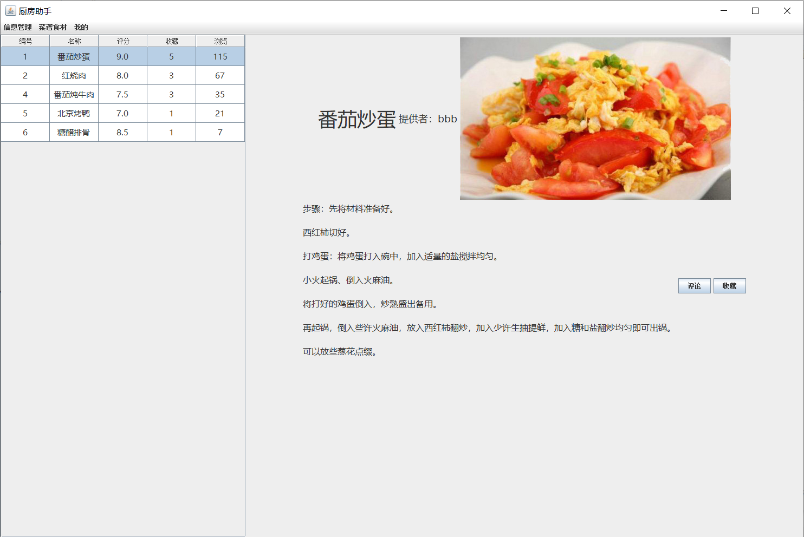
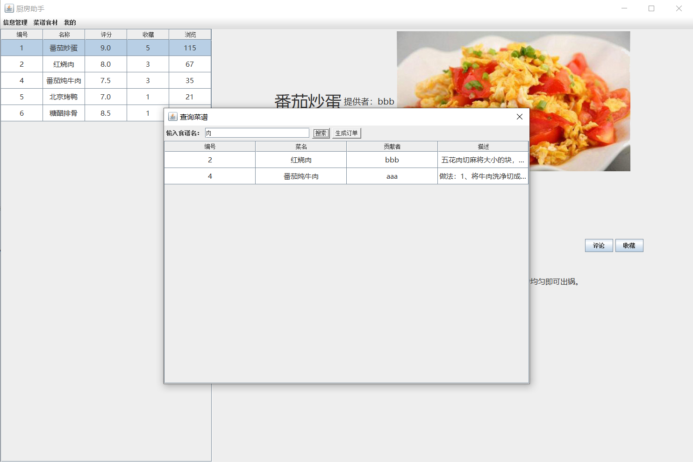
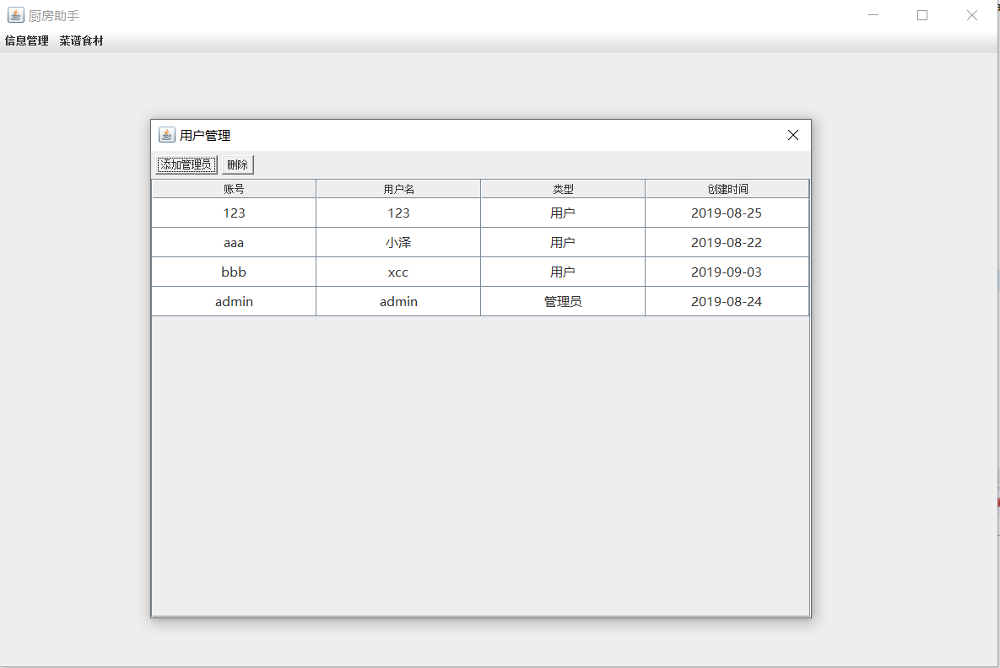

# MenuOrderSystem
A menu order system in java

**Attention:**

No extend java GUI framework! (using default java GUI is soooo difficult...I try my best to make it beautiful...)

Need Mysql to run! (menu.sql is given)

And menu.sql is given.

Some screenshots while running:

Given a sql screenshot(By Navicat for Mysql):

